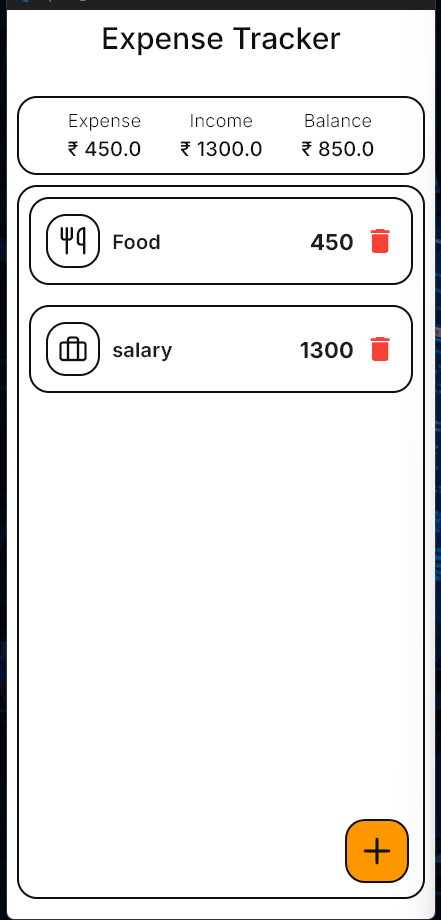
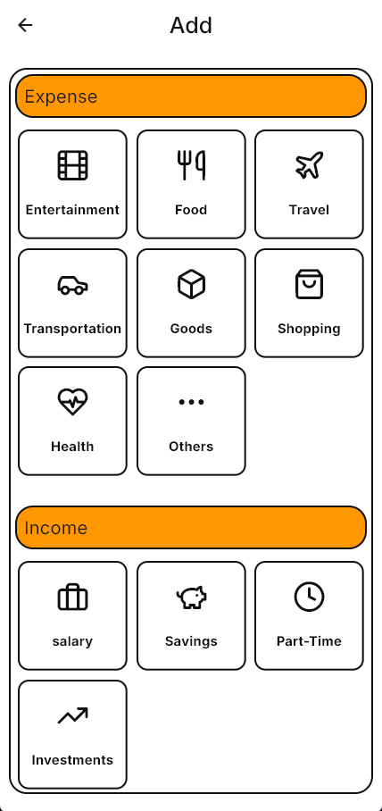
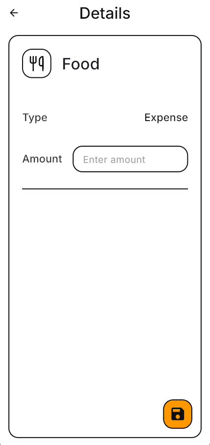
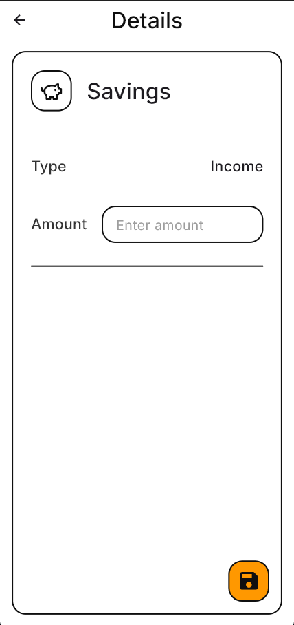

# 📊 Expense Tracker App (Flutter)

A clean and minimal **Expense Tracker mobile application** built using **Flutter and Dart**, focused on mastering core Flutter concepts such as state management, navigation, and UI architecture.

---

## ✨ Key Features

- ➕ Add **expenses and income** by category
- 🧮 Automatically calculated **Income, Expense, and Balance dashboard**
- 🗂️ Category-based entry system
- 🗑️ Delete entries with instant UI updates
- 📱 Responsive and clean neumorphic-inspired UI with Mobile first approach
- 🔁 Single source of truth using derived state

---

## 🧠 Key Learnings

- Parent–child communication using callbacks
- Navigation and data passing with `Navigator.push` / `Navigator.pop`
- Derived state (dashboard values computed from data, not stored separately)
- List add/delete lifecycle with `setState`
- Building scalable UI using `Expanded` and flexible layouts
- Implementation of Neumorphic-inspired Flat UI

---

## 🛠️ Tech Stack

- **Flutter**
- **Dart**
- **Material UI**
- **Google Fonts**
- **Lucide Icons**

---

## 📱 Screens

- Home Dashboard



- Category Selection  
  

- Details




---

## ▶️ Getting Started

```bash
flutter pub get
flutter run
```
